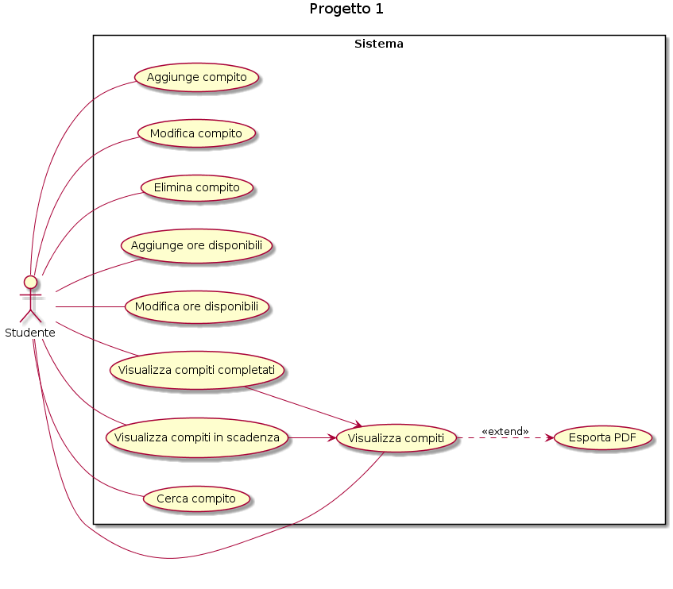

# Progetto 1
Al tempo della didattica a distanza (ma anche quando torneremo alla didattica tradizionale in classe) sorge sempre il problema di come gestire il problema dei compiti a casa. 

Spesso sono sbilanciati: ci sono materie con compiti che richiedono molto tempo (leggere intere pagine di un libro o scrivere programmi) e materie che ne richiedono molto meno (pochi esercizi, domande a crocette) . 

Proporre un'analisi di un sistema di gestione dei compiti vista dal punto di vista dello studente che permetta di organizzare al meglio i tempi di studio pomeridiani.

| Requisito | Tipologia | Priorità | Descrizione |
| --------- | --------- | -------- | ----------- |
| 1 | Funzionale | MUST | Lo studente aggiunge un compito da svolgere al sistema definendone la difficoltà |
| 2 | Funzionale | MUST | Lo studente elimina un compito dal sistema |
| 3 | Funzionale | MUST | Lo studente modifica un compito del sistema |
| 4 | Funzionale | MUST | Lo studente aggiunge le ore che ha disponibili al sistema |
| 5 | Funzionale | MUST | Lo studente modifica le ore che ha disponibili dal sistema |
| 6 | Funzionale | MUST | Lo studente visualizza i compiti organizzati nel sistema |
| 7 | Funzionale | MUST | Lo studente visualizza i compiti completati nel sistema |
| 9 | Funzionale | MUST | Lo studente visualizza i compiti in scadenza nel sistema |
| 10 | Funzionale | MUST | Lo studente cerca un compito nel sistema |
| 11 | Tecnologico | SHOULD/MUST | Il sistema è sviluppato in JavaScript |
| 12 | Non funzionale | MUST | Il sistema salva automaticamente il proprio stato (calendario e compiti) |
| 13 | Funzionale | SHOULD | Il sistema consente di esportare i compiti organizzati in formato PDF |

